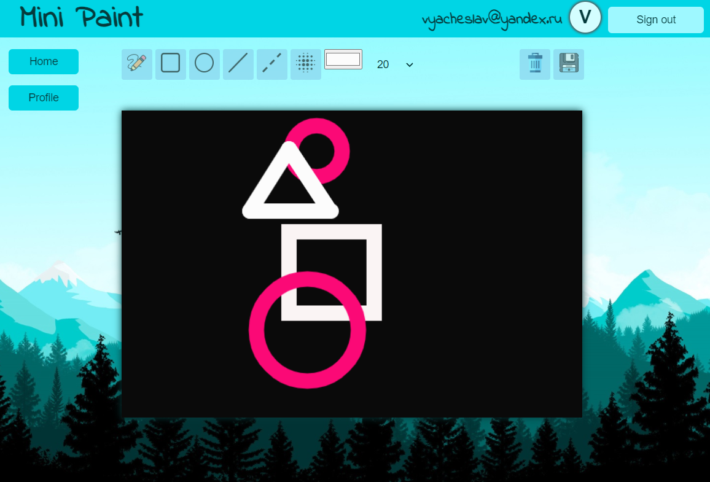
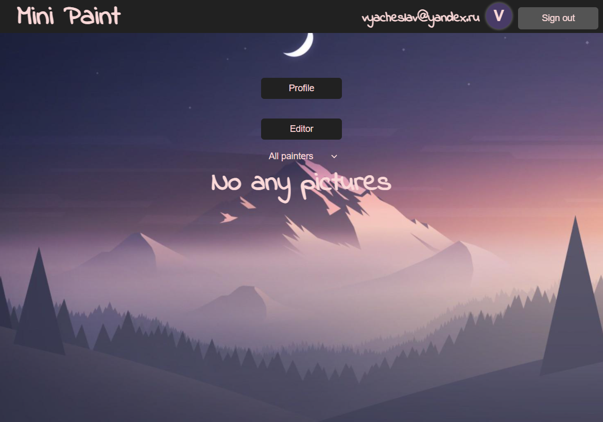

# Mini-paint
##### Innowise Lab Internship Project

### Application stack:
```
React, React-Router, Typescript, Redux, Redux-Saga, Firebase, Styled-Components, Eslint
```
### [Task description](https://docs.google.com/document/d/1feIA0eu0NkR4J2mCdCc8oPErbET--IlqAEoSpRo1KHA/edit#)
___

___

___

## Deployment on [Netlify](https://minipaint-slavislavi.netlify.app)
## How to run the app

Clone this [repository](https://github.com/slavaMatyuk/Mini-paint) and run:


```bash
git clone https://github.com/slavaMatyuk/Mini-paint.git

npm install
```

## How to use the app

```bash
# build a production version
npm run build

# run a development version
npm run start
```

## Database snapshot

```
└──users
     |──userId        
          ├── userName           
          ├── iserID
          ├── images
                 |── id
                 |── imageUrl
                 |── userName

└──library                  
      ├──userId
           ├──photo

```